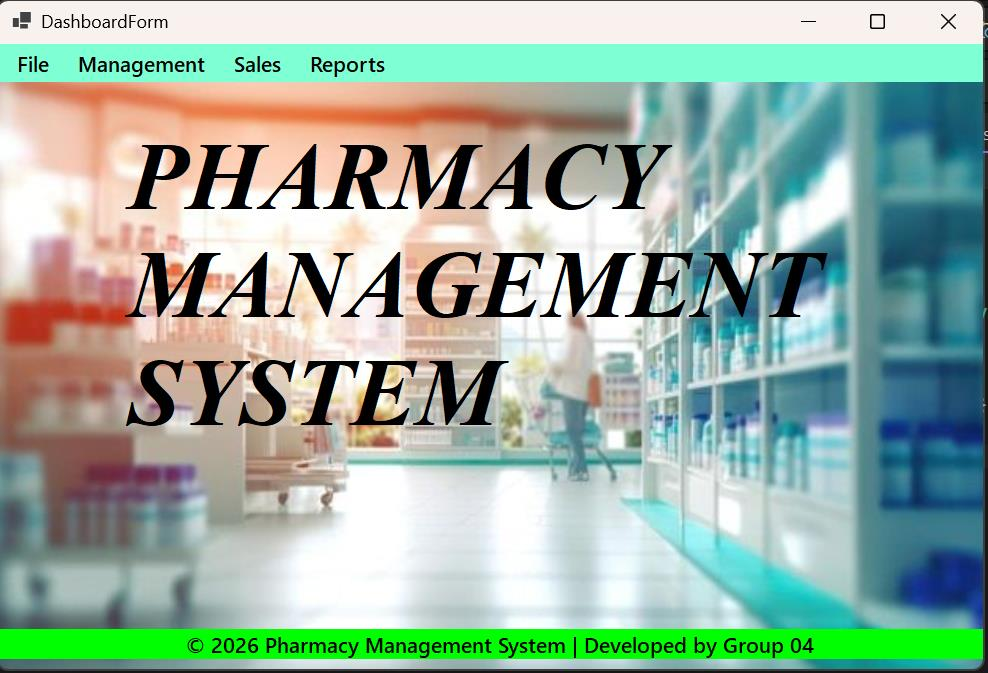
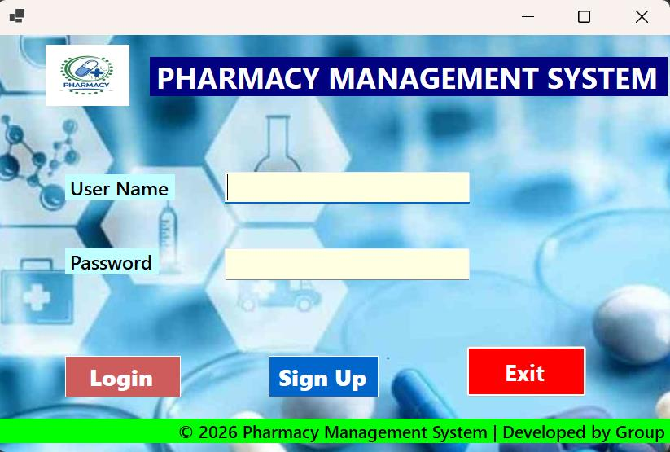
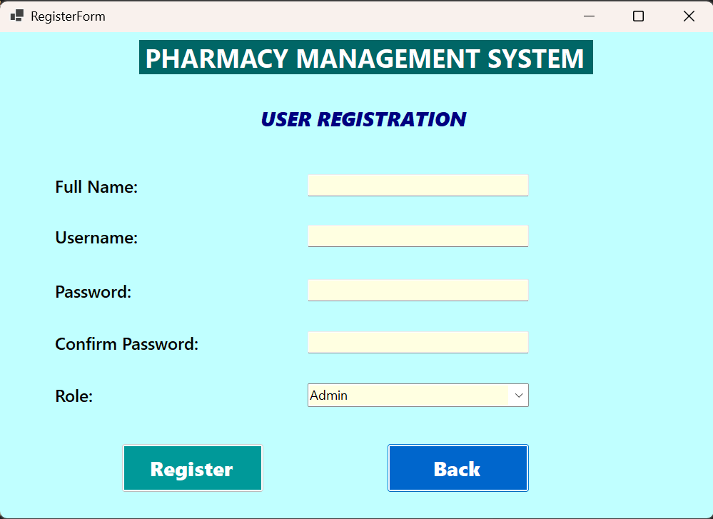
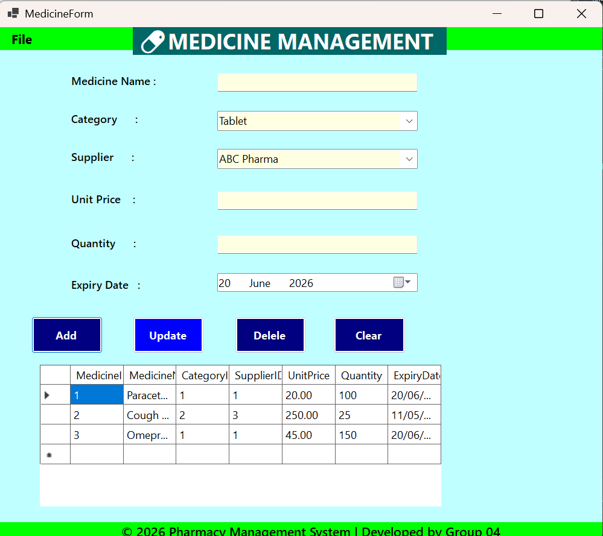
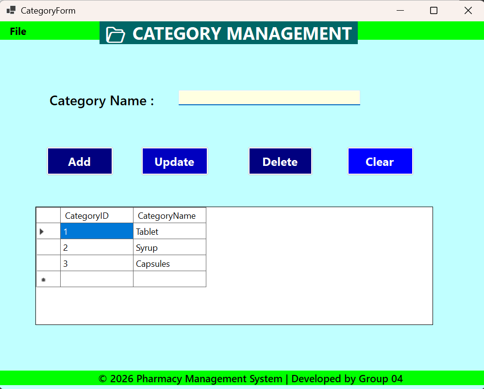
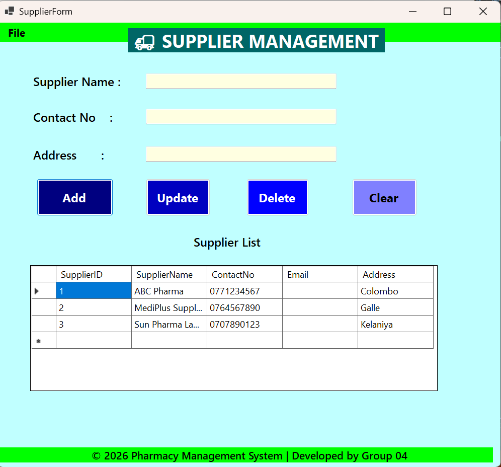
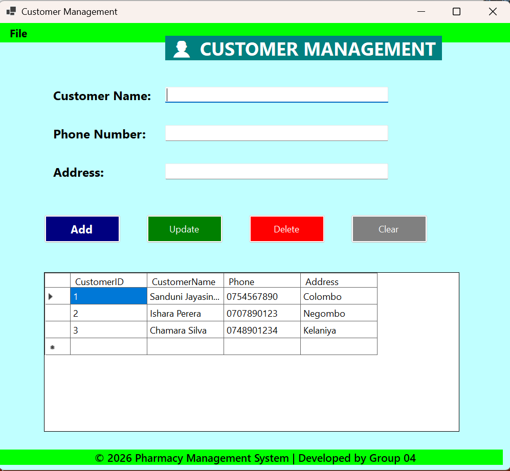
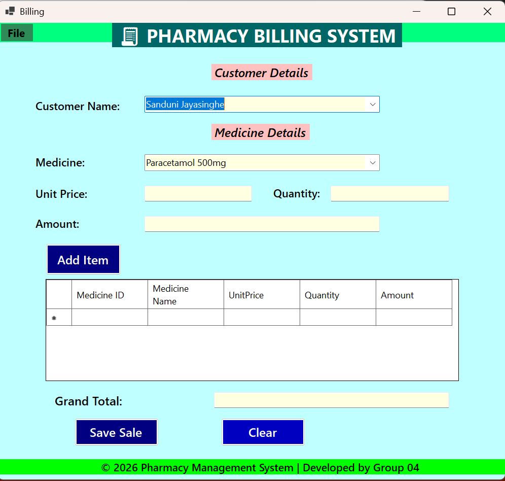
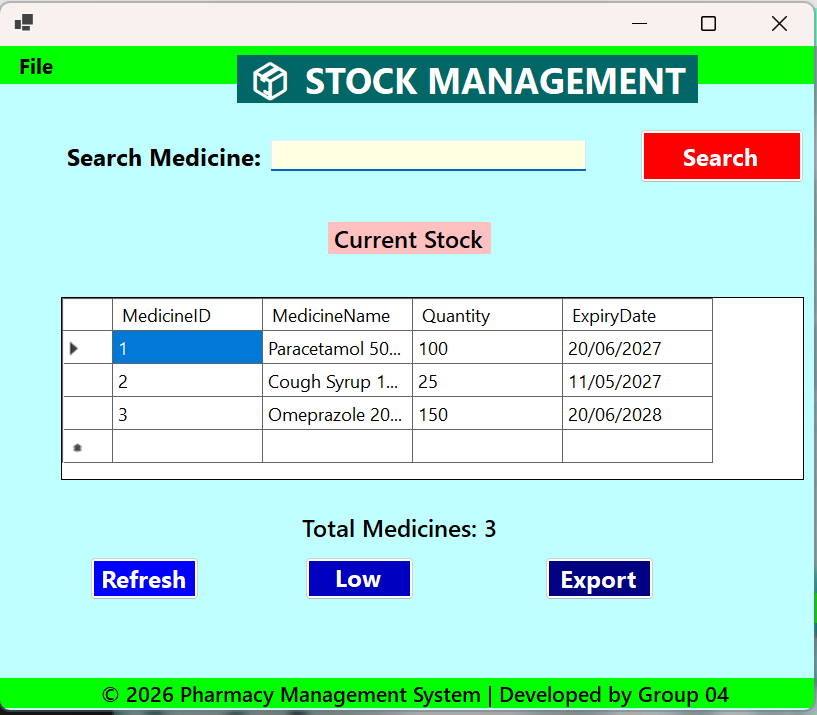
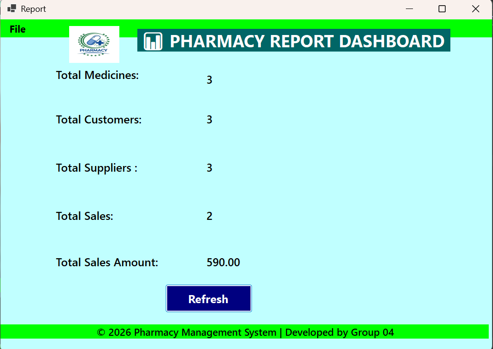

# 💊 Pharmacy Management System

A desktop application built with C# Windows Forms (.NET) and SQL Server, for managing day-to-day pharmacy operations — medicine inventory, suppliers, customers, billing, stock tracking, and sales reporting.

## 🎯 Overview

The Pharmacy Management System digitizes a pharmacy's daily operations, replacing manual record-keeping with a centralized, role-based desktop application. Staff can manage medicine inventory, categories, suppliers, and customers, process sales through a billing interface, track stock levels and expiry dates, and generate summarized reports. Access is controlled through a login and registration system supporting different user roles (Admin / Staff).

## 📦 Core Modules

| Module | Description |
|---|---|
| **Login / Registration** | Secure sign-in and new-user (Admin/Staff) account creation with role selection |
| **Dashboard** | Central navigation hub with menu access to Management, Sales, and Reports |
| **Medicine Management** | Add, update, delete, and search medicines with category, supplier, price, quantity, and expiry date |
| **Category Management** | Maintain medicine categories such as Tablet, Syrup, and Capsules |
| **Supplier Management** | Maintain supplier records including contact number and address |
| **Customer Management** | Maintain customer records including phone number and address |
| **Billing / Sales** | Create sales invoices by selecting a customer and adding medicines with quantity and price to compute a grand total |
| **Stock Management** | View current stock levels, search medicines, identify low stock, and export stock data |
| **Reports Dashboard** | Summarized view of total medicines, customers, suppliers, sales count, and total sales amount |

## 🖼️ Screenshots

| | |
|---|---|
| **Login**  | **Register**  |
| **Medicine Management**  | **Category Management**  |
| **Supplier Management**  | **Customer Management**  |
| **Billing**  | **Stock Management**  |
| **Reports Dashboard**  | |

## 🛠️ Tech Stack

- **Frontend:** C# Windows Forms (.NET)
- **Backend:** ADO.NET with `Microsoft.Data.SqlClient`
- **Database:** SQL Server

## 🚀 Getting Started

1. Open `Pharmacy Management System.slnx` in Visual Studio (with the ".NET Desktop Development" workload installed).
2. Set up the `PharmacyDB` database in SQL Server (LocalDB or SQL Server Express), matching the connection details in `DBConnection.cs`.
3. Build and run the project (F5).

## 👤 Team — Group 04

| Student ID | Module(s) Developed |
|---|---|
| PS/2022/250 — E.M.M.K. Dissanayake | Login Form, Dashboard Form, User Registration |
| PS/2022/211 — U.A.I. Vinodya | Medicine Form, Category Form |
| PS/2022/084 — L.K.M.S. Rajapaksha | Supplier Form, Billing Form |
| PS/2022/218 — M.I.A. Ishrath | Stock Form, Customer Management Form, Reports Form |

Full project documentation with detailed module descriptions is available in `PHARMACY MANAGEMENT SYSTEM.pdf`.
